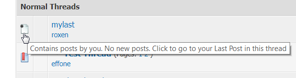

# MyLast
A MyBB plugin to add a link to any thread where you have posted to jump to your last post.

This is the upgraded version of old [MyLast plugin for MyBB 1.6.x](https://mods.mybb.com/view/mylast) to work with 1.8.x family.

## Compatibility
Designed / tested to be working with MyBB version **1.8.17**.

## Features
The plugin generates clickable links to forumdisplay and showthread to jump to the current (logged in) user's last post to the target thread.

### Forum Display View:
The plugin will convert the thread legend icons to clickable links if the thread contains post by the current user, clicking on which the last post made will be opened.

### Show Thread View
The plugin will add additional link at the bottom of Show Thread. Clicking on which if the current user has posted in the thread the same will be opened.

## Configuration
There is NO configuration for this plugin. Just activate and go ...

## Licence
The plugin is released under "[GNU LESSER GENERAL PUBLIC LICENSE, Version 3](https://www.gnu.org/licenses/lgpl-3.0.en.html)"

## Change log
Old 1.6.x versions:
- v.0.1: Initial release.
- v.0.2: Sanitized variables in query and little bug fix.
- v.0.3: Added Jump link in Thread List, Added a language file, Fixed bug (require_once).
- v.0.31: Forum display legend icons linked.

1.8.x versions:
- v.1.0.0 Initial release.